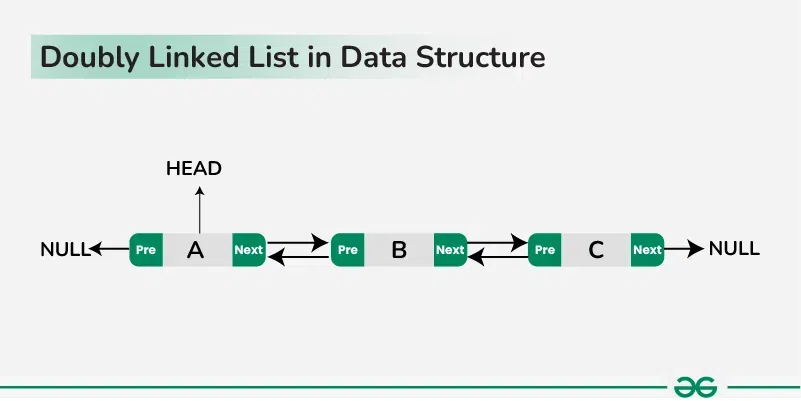

# Doubly Linked List
## Description

---

*Doubly Linked List* is a Java project containing classes for nodes that make up a class called a DoublyLinkedList.
These lists are structured like a circle; each node is only linked to the one in front of it and behind it.
The node at the first index is connected to the node at the second index and the node at the last index, creating the full circle shape of the DoublyLinkedList.

Each node can have their values individually changed, and nodes can be removed or added to any spot in the Doubly Linked List.
You can also check if a Doubly Linked List is empty, what its size is, and print the Doubly Linked List.

## Installation & Setup

---

1. Download the files off of this GitHub repository or clone this repository.
2. Delete the DoublyLinkedListTest class.
3. The code in the Main class are examples and can be deleted or replaced.

## Usage

---

### Node Class
- Node has 3 constructors (*value* is the node's value, *previous* is the previous node in the Doubly Linked List, and *next* is the next node in the Doubly Linked List)
  - Node(E val)
  - Node(E value, Node previous)
  - Node(E value, Node previous, Node next)
- Each of Node's instance variables can have their own getters and setters
  - getValue()
  - getPrevNode()
  - getNextNode()
  - setValue(E value)
  - setPrevNode(Node previous)
  - setNextNode(Node next)
- Node can be printed
- Use .equals() to compare nodes
  - EX: node1.equals(node2)
### DoublyLinkedList Class
- DoublyLinkedList uses the default constructor, where E is a class type
  - DoublyLinkedList<String> example = new DoublyLinkedList<>();
- Use add() to create a new node and add it to the specified index in the list or to the last index of the list
  - example.add(E valueForNewNode)
  - example.add(int index, E valueForNewNode)
- Use remove() to delete all the nodes in the list
  - example.remove()
- Use remove(int index) to remove a node from the specified index. The function will return the removed node.
  - Node removedNode = example.remove(3)
- Use get(int index) to get a node at the specified index
  - Node retrievedNode = example.get(15)
- Use set(int index, E valueForNewNode) to set the node at the given index to the new value
  - example.set(23, "Red Apple")
- Use size() to get an int that represents the number of nodes in the list
  - int size = example.set()
- Use isEmpty() to get a boolean that will be true if there are no nodes in the list
  - boolean empty = example.isEmpty()
- DoublyLinkedList can be printed

## Resources

---

- [Doubly Linked List visualization](https://www.geeksforgeeks.org/dsa/why-use-a-doubly-linked-list/)
